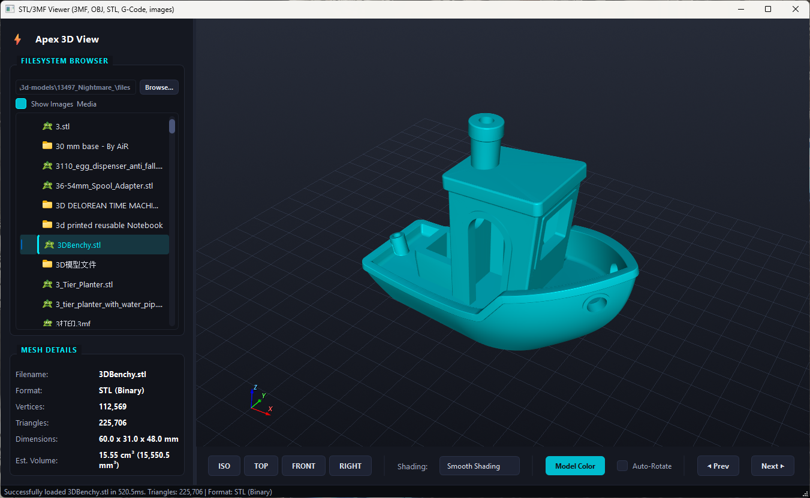
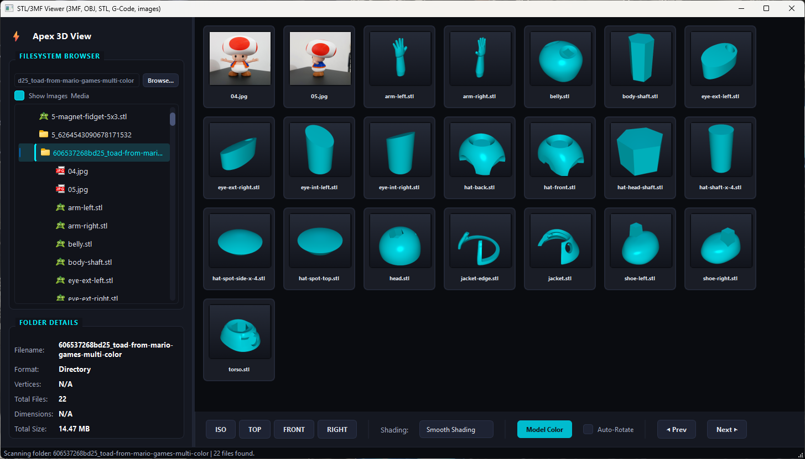

# Apex 3D Viewer

A desktop 3D file viewer built with Python, PySide6, and VTK. Supports STL, 3MF, OBJ, G-Code, and common image/video formats with a dark theme UI.


---

## Screenshots





---

## Features

- **3D Mesh Viewer** — STL (ASCII & binary), 3MF (with component assemblies & transforms), Wavefront OBJ, G-Code toolpaths
- **Image & Media Viewer** — JPEG, PNG, BMP, TIFF, GIF (animated), SVG (vector), WebM video
- **Thumbnail Grid** — folder browser with live thumbnail previews; SQLite-backed cache so thumbnails are only rendered once
- **Shading Modes** — Smooth (Phong), Flat, Wireframe, Point Cloud
- **Camera Controls** — trackball mouse navigation, ISO/Top/Front/Right presets, Auto-Rotate
- **Model Color Picker** — change diffuse colour via colour dialog
- **Prev / Next navigation** — step through files in the same folder without touching the tree
- **Zoom & Pan** — mouse-wheel zoom and drag-to-pan in the image viewer
- **Mesh Metadata** — vertices, triangles/lines, bounding box dimensions, estimated volume
- **Orientation Marker** — XYZ axis widget in the viewport corner

---

## Supported Formats

| Format | Extension | Notes |
|--------|-----------|-------|
| STL | `.stl` | ASCII and binary |
| 3MF | `.3mf` | Single meshes and hierarchical component assemblies |
| Wavefront OBJ | `.obj` | Triangles and quads (fan triangulation) |
| G-Code | `.gcode` `.gco` | Toolpath line preview |
| JPEG | `.jpg` `.jpeg` | |
| PNG | `.png` | |
| BMP | `.bmp` | |
| TIFF | `.tiff` `.tif` | |
| GIF | `.gif` | Animated playback |
| SVG | `.svg` | Vector, sharp at any zoom |
| WebM | `.webm` | Video with play/pause/seek/mute controls |

---

## Requirements

- Python 3.10+
- PySide6 >= 6.5
- VTK >= 9.2
- NumPy

Install dependencies:

```bash
pip install PySide6 vtk numpy
```

---

## Running

```bash
python app.py
```

---

## Building a Standalone EXE

Requires [PyInstaller](https://pyinstaller.org):

```bash
pip install pyinstaller
pyinstaller app.spec
```

Output: `dist\STLViewer\STLViewer.exe` (run from the folder — do not move the EXE out of `dist\STLViewer\`).

---

## Project Structure

```
stl_viewer/
├── app.py          # Main application — UI, workers, thumbnail cache
├── renderer.py     # VTK 3D viewport widget
├── parsers.py      # STL / 3MF / OBJ / G-Code geometry parsers
├── styles.py       # Qt stylesheet (dark theme)
├── app.spec        # PyInstaller build spec
├── models/         # Sample test models
│   ├── ascii_cube.stl
│   ├── binary_cylinder.stl
│   ├── pyramid_mesh.3mf
│   ├── hierarchical_assembly.3mf
│   ├── cube.obj
│   └── spiral_path.gcode
├── generate_test_files.py   # Generates the sample models
└── test_parsers.py          # Parser validation tests
```

---

## Thumbnail Cache

Thumbnails are stored in a SQLite database at:

```
%USERPROFILE%\.gemini\antigravity-ide\thumbnails.db
```

Each entry is keyed on `MD5(absolute_path)` and invalidated automatically when the file's modification time or size changes. Delete the database to force a full re-render.

---

## Running Tests

```bash
python generate_test_files.py   # create sample models first
python test_parsers.py          # validate parsers and volume calculations
```

---

## Controls

| Action | Input |
|--------|-------|
| Orbit camera | Left mouse drag |
| Pan | Middle mouse drag |
| Zoom | Scroll wheel |
| Reset view | ISO / TOP / FRONT / RIGHT buttons |
| Auto-rotate | Auto-Rotate checkbox |
| Previous / next file | ◀ Prev / Next ▶ buttons |
| Zoom image | Scroll wheel (image viewer) |
| Pan image | Left mouse drag (image viewer) |
